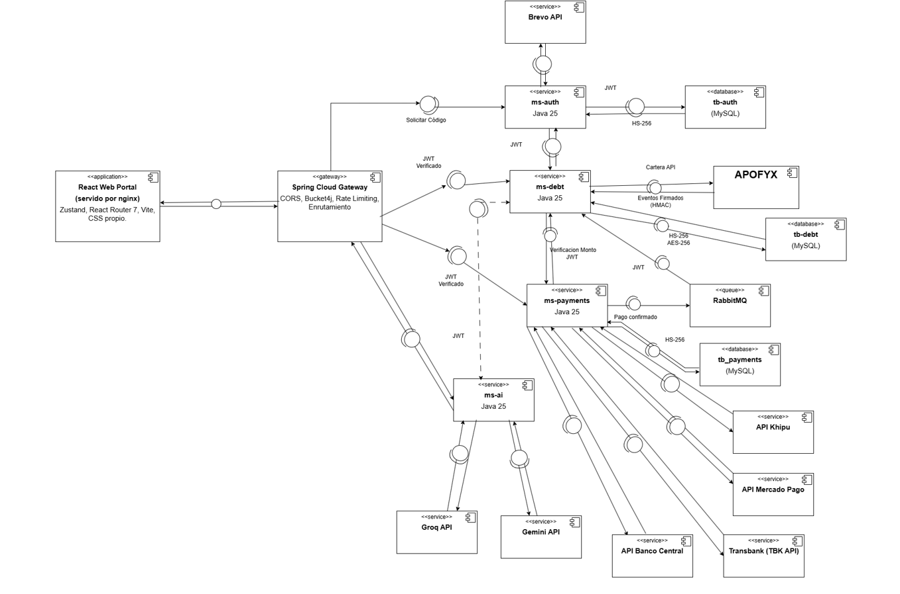
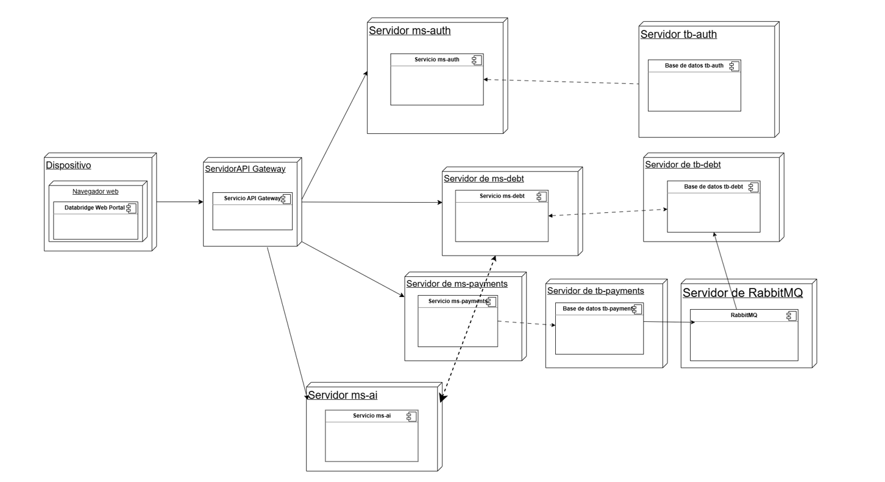
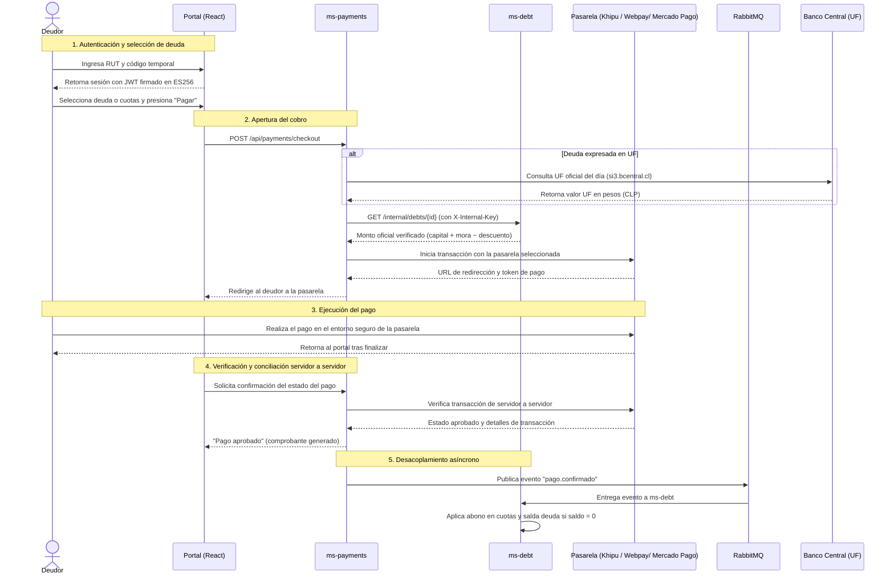
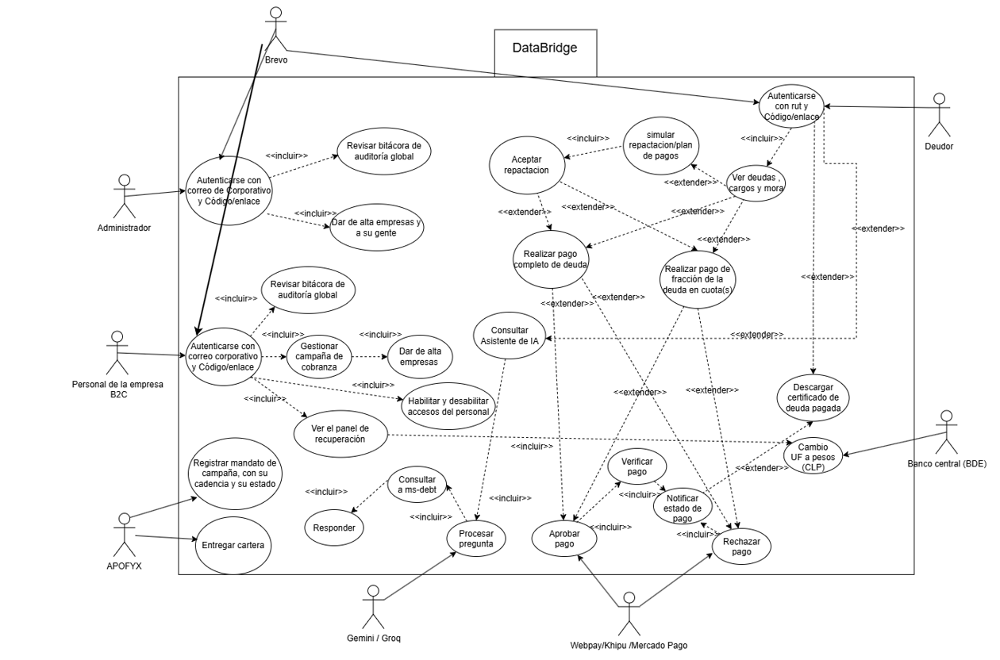
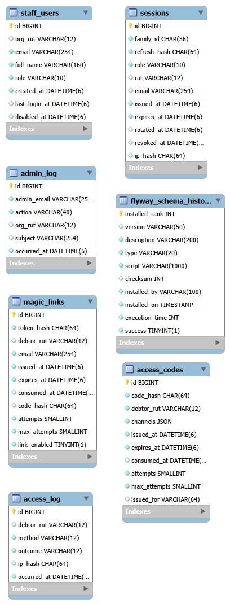
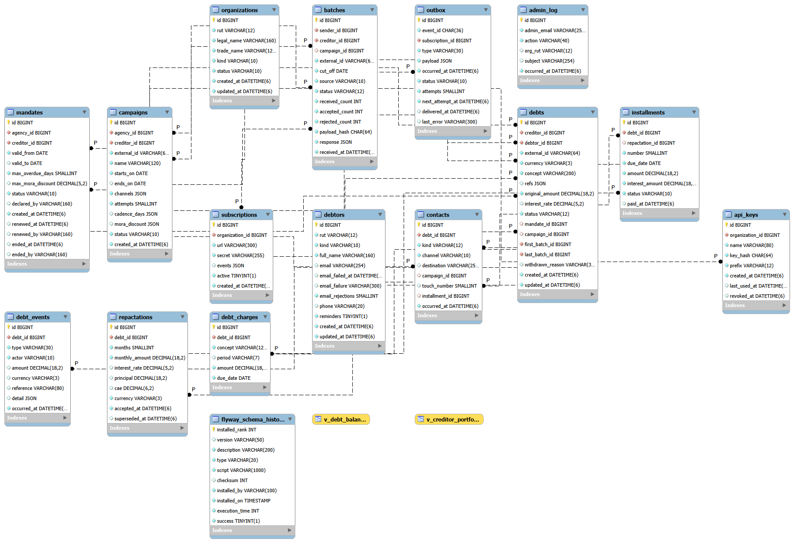
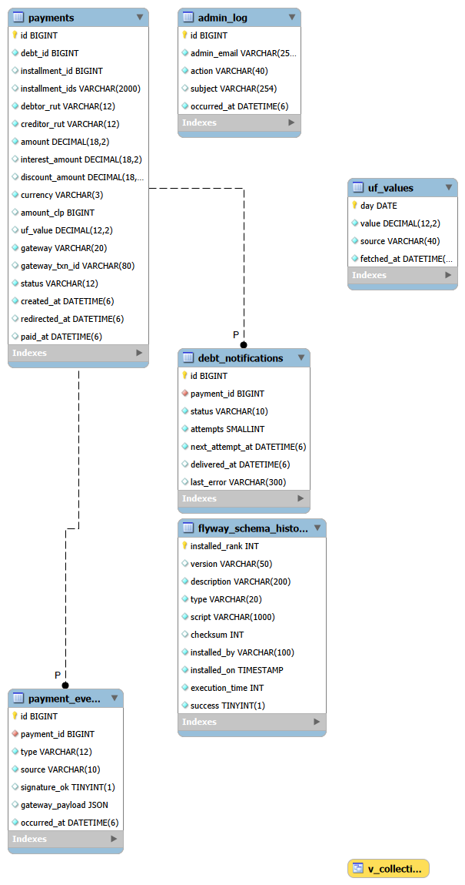

## 1 <picture><source media="(prefers-color-scheme: dark)" srcset="frontend/public/marca/simbolo-oscuro.svg"></picture> DataBridge

[](https://github.com/TechnicalBridge/DataBridge/actions/workflows/gateway.yml) [](https://github.com/TechnicalBridge/DataBridge/actions/workflows/ms-auth.yml) [](https://github.com/TechnicalBridge/DataBridge/actions/workflows/ms-debt.yml) [](https://github.com/TechnicalBridge/DataBridge/actions/workflows/ms-payments.yml) [](https://github.com/TechnicalBridge/DataBridge/actions/workflows/frontend.yml) [](https://github.com/TechnicalBridge/DataBridge/actions/workflows/ms-ai.yml) [](https://github.com/TechnicalBridge/DataBridge/actions/workflows/codeql.yml)

**La plataforma donde el deudor en cobranza paga, repacta o reclama su deuda, sin llamar a nadie**, sea del rubro que sea: arriendos, aranceles, tratamientos, planes mensuales. Proyecto de Capstone del equipo **Technical Bridge**; las empresas, las personas y los RUT son ficticios.

---

## Índice

- [1. Nombre del proyecto](#1-nombre-del-proyecto)
- [2. Descripción](#2-descripción)
  - [Qué hace](#qué-hace)
  - [A quién va dirigido](#a-quién-va-dirigido)
  - [Qué problema resuelve](#qué-problema-resuelve)
- [3. Tecnologías utilizadas](#3-tecnologías-utilizadas)
  - [Lenguajes](#lenguajes)
  - [Frameworks y librerías](#frameworks-y-librerías)
  - [Base de datos](#base-de-datos)
  - [Cloud y servicios externos](#cloud-y-servicios-externos)
- [4. Instrucciones para ejecutar el proyecto localmente](#4-instrucciones-para-ejecutar-el-proyecto-localmente)
  - [Requisitos previos](#requisitos-previos)
  - [Paso a paso en Docker](#paso-a-paso-en-docker)
  - [Servicios y URLs principales](#servicios-y-urls-principales)
  - [Cuentas de prueba y demostración](#cuentas-de-prueba-y-demostración)
- [5. Integrantes del equipo con sus roles](#5-integrantes-del-equipo-con-sus-roles)
- [6. Metodología de trabajo del equipo](#6-metodología-de-trabajo-del-equipo)
  - [Marco de trabajo: Scrumban](#marco-de-trabajo-scrumban)
  - [Prácticas DevOps y aseguramiento de calidad](#prácticas-devops-y-aseguramiento-de-calidad)
  - [Pruebas automatizadas (1.359 pruebas Java)](#pruebas-automatizadas-1359-pruebas-java)
- [7. Arquitectura de la solución](#7-arquitectura-de-la-solución)
  - [Descripción de la arquitectura](#descripción-de-la-arquitectura)
  - [Diagrama general de componentes y comunicación](#diagrama-general-de-componentes-y-comunicación)
  - [Diagrama de despliegue físico](#diagrama-de-despliegue-físico)
  - [Diagrama de secuencia del flujo principal](#diagrama-de-secuencia-del-flujo-principal)
  - [Diagrama de casos de uso](#diagrama-de-casos-de-uso)
  - [Diagramas entidad-relación (ER)](#diagramas-entidad-relación-er)
  - [Detalle de arquitectura en vistas 4+1](#detalle-de-arquitectura-en-vistas-41)
- [Documentación complementaria](#documentación-complementaria)


---

## 2 Descripción

### Qué hace

**DataBridge es una plataforma de autoservicio para la gestión y regularización de deudas morosas.** Permite al deudor acceder sin contraseñas convencionales utilizando su RUT y un código de seis caracteres enviado a su correo electrónico. Desde la plataforma puede:

- **Pagar de una vez**: mediante pasarelas de pago digitales integradas (Webpay Plus de Transbank, Mercado Pago Checkout Pro o Khipu).
- **Repactar en cuotas**: simular y pactar convenios de 3 a 24 cuotas, con cálculo transparente del costo total y Carga Anual Equivalente (CAE), pudiendo pagar cuotas de forma individual o agrupada desde la que vence primero.
- **Reclamar cobros no correspondientes**: impugnar una deuda si no la reconoce, ya fue pagada o presenta inconsistencias. Mientras la empresa revisa la situación, la cobranza y los recordatorios quedan suspendidos.
- **Consultar a un asistente inteligente**: resolver dudas mediante un asistente que consulta su deuda en tiempo real con su propia sesión autenticada.
- **Descargar comprobantes y certificados**: emitir certificados de deuda pagada (deuda cero) y comprobantes de pago individuales en PDF.

Para las **empresas que gestionan la cartera** (agencias de cobranza como APOFYX o acreedores directos), el portal ofrece:

- **Carga de cartera por campañas**: ingesta masiva mediante planilla Excel con validación previa de inconsistencias antes de confirmar.
- **Cumplimiento legal de contacto**: ejecución automatizada de contactos respetando los límites de frecuencia y horarios que estipula la ley chilena (Ley 19.496).
- **Gestión integral**: resolución de reclamos, seguimiento de convenios en riesgo (con cuotas vencidas), reenvío de códigos de acceso y panel analítico de recuperación y cálculo de comisiones.

### A quién va dirigido

| Actor | Rol en DataBridge |
| :--- | :--- |
| **La persona que debe (Deudor)** | Usuario principal del portal público. Accede con su RUT y código temporal para consultar sus montos, repactar, pagar en línea o reclamar. |
| **La empresa que cobra (Agencia o Acreedor directo)** | Gestiona sus campañas de cobranza, carga carteras masivas, reenvía códigos de acceso, resuelve impugnaciones y analiza la recaudación en el portal de empresas. |
| **El acreedor final (Inmobiliaria, instituto, clínica, etc.)** | Cuando delega la cobranza en una agencia, puede recibir en su sistema notificaciones firmadas vía webhook (`/api/v1`) ante cada pago o convenio si la integración API está activa. |
| **Equipo de administración DataBridge (`admin`)** | Habilita empresas usuarias y sus colaboradores, supervisa la bitácora de auditoría global (`admin_log`, `access_log`) y monitorea la salud de los servicios. |

### Qué problema resuelve

- **Costo desproporcionado de la cobranza tradicional**: La gestión de deudas menores mediante canales telefónicos o cartas postales suele tener un costo operativo superior al margen recuperable, provocando abandono o castigo de cartera.
- **Barreras para el deudor que desea ponerse al día**: La cobranza convencional impone esperas telefónicas en horarios de oficina restrictivos y carece de mecanismos transparentes para simular pagos accesibles o impugnar cobros erróneos.
- **Solución integral**: DataBridge digitaliza el proceso en ambas direcciones: el deudor opera 24/7 con autonomía, mientras la empresa recauda y concilia automáticamente sin intervención manual.

---

## 3 Tecnologías utilizadas

### Lenguajes

| Lenguaje | Versión | Uso en la solución |
| :--- | :--- | :--- |
| **Java** | 25 | Backend completo: gateway y los microservicios ms-auth, ms-debt, ms-payments y ms-ai. |
| **JavaScript** | ES2022 con JSX | Frontend React del portal (deudor, empresas y panel de administración). |
| **SQL** | MySQL 8.4 | Definición de esquemas relacionales, vistas y migraciones versionadas. |

### Frameworks y librerías

| Capa / Componente | Tecnología | Propósito |
| :--- | :--- | :--- |
| **Backend** | Spring Boot 3.5 · Spring Security · Spring Data JPA · Bean Validation | Microservicios de negocio modulares y APIs REST seguras. |
| **Gateway & Resiliencia** | Spring Cloud Gateway · Bucket4j | Puerta de entrada única: enrutamiento, validación CORS y rate limiting distribuido por IP. |
| **Frontend** | React 18 · React Router 7 · Vite · Zustand · Recharts | SPA responsiva con diseño CSS nativo modular. |
| **Seguridad & Autenticación** | JWT con **ES256 (ECDSA P-256)** · spring-security-oauth2-jose · JWKS | Sesiones sin contraseñas; firmas criptográficas asimétricas y verificación distribuida vía `/.well-known/jwks.json`. |
| **Cifrado & Hashing** | SHA-256 · AES-256-GCM (JCA) | Almacenamiento seguro de hashes para credenciales efímeras e IPs; cifrado en reposo para secretos de suscripción. |
| **Mensajería Asíncrona** | RabbitMQ 3.13 (AMQP 0-9-1) | Propagación asíncrona desacoplada de avisos de pago (`pago.confirmado`). |
| **Asistente Inteligente** | SDK oficial OpenAI para Java (`openai-java`) | Consultas LLM compatibles con Groq y Gemini, con fallback automático a motor de reglas local (`MotorLocal`). |
| **Documentación & Hipermedios** | springdoc-openapi (Swagger) · Spring HATEOAS | Documentación interactiva OpenAPI 3 y enlaces hipermedia en respuestas REST. |
| **Plantillas y Correo** | Jakarta Mail · Thymeleaf | Renderizado de correos transaccionales en HTML responsivo y texto plano. |

### Base de datos

- **MySQL 8.4 (*Database-per-service*)**: Aislamiento estricto de datos con tres bases independientes:
  - `tb_auth`: Códigos de acceso hasheados, enlaces mágicos, sesiones, usuarios de personal y bitácora de accesos.
  - `tb_debt`: Empresas, mandatos, campañas, deudores, deudas, cargos, convenios, contactos y outbox de eventos.
  - `tb_payments`: Transacciones de pago, eventos de pasarelas, avisos de conciliación y valores históricos de la UF.
- **Flyway**: Versionamiento ordenado de esquemas relacionales con validación automática al inicio (`ddl-auto: validate`).

### Cloud y servicios externos

| Servicio / Proveedor | Propósito | Alternativa / Modo local |
| :--- | :--- | :--- |
| **Docker & Docker Compose** | Orquestación local con perfiles `app` y `carga`, y archivo `docker-compose.prod.yml` para producción. | Despliegue en contenedores locales aislados. |
| **Transbank (Webpay Plus REST v1.2)** | Pagos con tarjeta de débito, crédito y prepago. | Modo simulación local (`TRANSBANK_ENVIRONMENT=SIMULADA`). |
| **Khipu (API v3)** | Cobro directo vía transferencia electrónica bancaria. | Simulación automática sin credenciales configuradas. |
| **Mercado Pago (Checkout Pro)** | Cobros con billetera digital y tarjetas. | Simulación automática sin token configurado. |
| **Banco Central de Chile (`si3.bcentral.cl`)** | Obtención en línea del valor diario oficial de la UF. | Carga estática manual de UF en base de datos. |
| **Brevo API / Servidores SMTP** | Despacho de correos electrónicos transaccionales. | Buzón de correo local Mailpit (http://localhost:8025). |
| **Groq / Google Gemini** | Modelos de lenguaje natural para el asistente de deudas. | Motor local de reglas (`MotorLocal`) sin requerir API keys. |

---

## 4 Instrucciones para ejecutar el proyecto localmente

### Requisitos previos

- **Docker Desktop** en ejecución con al menos 4 GB de memoria RAM asignados.
- Conexión a internet la primera vez para la descarga de dependencias e imágenes base.

### Paso a paso en Docker

```powershell
# 1. Clonar el repositorio
git clone https://github.com/TechnicalBridge/DataBridge.git
cd DataBridge

# 2. Generar el par de claves criptográficas JWT ES256 (una sola vez)
powershell -ExecutionPolicy Bypass -File .\scripts\generar-claves-jwt.ps1

# 3. Generar el archivo .env con contraseñas seguras aleatorias (una sola vez)
powershell -ExecutionPolicy Bypass -File .\preparar-env.ps1

# 4. (Opcional) Para cargar datos de demostración en una base nueva:
# Asegurar DEMO_DATOS=true en el archivo .env

# 5. Levantar todos los contenedores y esperar a que estén en estado saludable
docker compose --profile app up -d --build --wait
```

> **Nota:** La bandera `--wait` retorna el control a la terminal únicamente cuando los once contenedores están completamente inicializados y saludables (*healthy*). Para pruebas de carga se utiliza `--profile carga`, y para producción el archivo `docker-compose.prod.yml`.

### Servicios y URLs principales

| Servicio | URL | Descripción y Credenciales |
| :--- | :--- | :--- |
| **Portal Web** | [http://localhost:8080](http://localhost:8080) | Interfaz unificada de deudores, empresas y administración. |
| **Documentación OpenAPI / Swagger** | [http://localhost:8080/swagger-ui.html](http://localhost:8080/swagger-ui.html) | Catálogo interactivo de endpoints de los microservicios. |
| **Buzón de prueba (Mailpit)** | [http://localhost:8025](http://localhost:8025) | Interfaz web para consultar los correos y códigos de acceso emitidos. |
| **Consola RabbitMQ** | [http://localhost:15672](http://localhost:15672) | Usuario: `guest`, contraseña: valor de `RABBIT_PASSWORD` en `.env`. |
| **Bases de datos MySQL** | `127.0.0.1:3308` (`tb_auth`)<br>`127.0.0.1:3309` (`tb_debt`)<br>`127.0.0.1:3310` (`tb_payments`) | Usuario: `tbridge`, contraseñas configuradas en `.env`. |

Para apagar el entorno:
```powershell
docker compose --profile app down
# Para detener y reiniciar con base de datos limpia:
docker compose --profile app down -v
```

### Cuentas de prueba y demostración

Con `DEMO_DATOS=true`:
- **Acceso Empresa**: Ingresar a *Soy de una empresa* con el correo `camila.reyes@example.com`. El código de acceso de un solo uso llegará al buzón Mailpit (http://localhost:8025).
- **Acceso Deudor**: Ingresar en *Tengo un código de acceso* o mediante solicitud de código con RUTs de ejemplo:
  - `16.482.337-7`: Deudor en convenio de 6 cuotas (3 pagadas).
  - `19.230.418-0`: Deudor con totalidad de deuda saldada.
  - `14.583.206-3`: Deudor con reclamo ingresado por monto disputado.
  - `76.991.245-2`: Empresa deudora con deuda pactada en UF.

Para ver el recorrido guiado completo de demostración, consultar [docs/demo/recorrido-demostracion.md](docs/demo/recorrido-demostracion.md).

---

## 5 Integrantes del equipo con sus roles

| Integrante | Rol | Responsabilidades clave |
| :--- | :--- | :--- |
| **Flavio Henríquez** | Product Owner | Priorización del backlog, redacción de historias de usuario con criterios de aceptación y aprobación de paso a *Ready*. |
| **Martín Gutiérrez** | Scrum Master | Facilitación del flujo continuo, gestión de impedimentos, control del WIP y facilitación de ceremonias de retrospectiva. |
| **Esteban Maino** | Desarrollador fullstack y Project Coordinator | Coordinación del proyecto y desarrollo en Spring Boot y React. |
| **Pedro Campos** | Desarrollador fullstack y QA Tester | Desarrollo integral en backend y frontend, diseño y ejecución de pruebas automatizadas y aseguramiento de calidad. |

---

## 6 Metodología de trabajo del equipo

### Marco de trabajo: Scrumban

El equipo adopta **Scrumban**, combinando la estructura de gobierno y roles de **Scrum** con la entrega de valor continua y control de flujo de **Kanban**:

- **Roles Scrum definidos**:
  - **Product Owner (Flavio Henríquez)**: Prioriza el backlog, escribe los criterios de aceptación y decide qué pasa a *Ready*.
  - **Scrum Master (Martín Gutiérrez)**: Cuida que el trabajo fluya, que nadie exceda el límite de tarjetas en curso y abre las retrospectivas.
  - **Project Coordinator y Desarrollador Fullstack (Esteban Maino)**: Programa en backend y portal, y coordina el avance del proyecto.
  - **QA Tester y Desarrollador Fullstack (Pedro Campos)**: Programa en backend y portal, e implementa y valida las pruebas automatizadas.
- **Flujo Kanban sin Sprints fijos**: Las tareas avanzan de forma continua a través del tablero Kanban de GitHub Projects a través de las columnas: *Backlog → Ready → In Progress → In Review → Done*.
- **Control de WIP (Work In Progress)**: Límite estricto de máximo 2 tarjetas simultáneas en *In Progress* por persona para minimizar cambios de contexto y reducir los tiempos de ciclo (*lead time*).
- **Trunk-Based Development y Ramas cortas**: Desarrollo sobre `main` a través de ramas cortas (`tipo/numero-descripcion`), integradas mediante Pull Requests atómicos con revisión de código cruzada y aprobación de CI.
- **Definition of Done (DoD)**: Todo Pull Request debe cumplir con verificación de pruebas automatizadas en verde, análisis de seguridad sin vulnerabilidades, documentación al día y validación funcional antes de integrarse.

### Prácticas DevOps y aseguramiento de calidad

| Práctica DevOps | Implementación en DataBridge | Beneficio |
| :--- | :--- | :--- |
| **Integración Continua (CI)** | GitHub Actions en cada push y PR (flujos para cada microservicio, frontend y gateway). | Garantiza que todo cambio compila y pasa la suite completa de pruebas en entornos limpios e independientes. |
| **Análisis Estático y Seguridad** | CodeQL y Gitleaks integrados en los flujos de CI. | Detección preventiva de vulnerabilidades de código y prevención de filtración de secretos. |
| **Infraestructura como Código (IaC)** | Docker Compose orquestando 11 contenedores con perfiles `app` y `carga`, más `docker-compose.prod.yml`. | Despliegue determinista y replicable idéntico en local y producción. |
| **Evolución de Base de Datos** | Flyway ejecutando migraciones SQL ordenadas y versionadas. | Eliminación de desfases entre esquemas de base de datos y validación al inicio (`ddl-auto: validate`). |

### Pruebas automatizadas (1.359 pruebas Java)

El proyecto cuenta con **1.359 pruebas automatizadas en Java**, medidas con JDK 25 mediante los reportes XML de Maven Surefire sobre `main` (commit `f60c5c2`), que se ejecutan sin fallos en los flujos de CI de GitHub Actions:

```powershell
# Ejecutar las pruebas de un servicio específico:
.\mvnw.cmd -f ms-debt\pom.xml clean test

# Ejecutar las cinco suites de Java:
foreach ($s in "gateway","ms-auth","ms-debt","ms-payments","ms-ai") { .\mvnw.cmd -q -f "$s\pom.xml" clean test }
```

| Módulo / Servicio | Cantidad de pruebas | Tipos de pruebas cubiertas | Herramientas / Frameworks |
| :--- | :---: | :--- | :--- |
| **ms-debt** | **541** | Reglas de negocio CAE, contratos, mandatos, campañas, outbox y reportes | JUnit 5, Mockito, AssertJ, MockMvc |
| **ms-auth** | **322** | Autenticación passwordless, firma/validación ES256, JWKS, rate limiting y auditoría | JUnit 5, Mockito, spring-security-oauth2-jose, MockMvc |
| **ms-payments** | **303** | Pasarelas (Webpay, Khipu, Mercado Pago), conciliación, cálculo UF y eventos RabbitMQ | JUnit 5, Mockito, AssertJ, MockMvc |
| **ms-ai** | **164** | Cliente LLM, motor local de fallback (`MotorLocal`), aislamiento de sesión y contexto | JUnit 5, Mockito, MockMvc |
| **gateway** | **29** | Enrutamiento de rutas, filtros de seguridad, cortafuegos de IPs y límites de tasa (Bucket4j) | JUnit 5, Spring Boot Test, MockMvc |
| **Total suite Java** | **1.359 pruebas** | Cobertura integral continua en cada Pull Request sin fallos | GitHub Actions CI (JDK 25) |

> **Nota sobre el portal:** El frontend no posee suite de pruebas unitarias automatizadas (`.test.jsx`); su verificación se realiza en CI mediante compilación estricta (`npm ci` y `npm run build`), control de tipos y revisión manual en navegador. Para detalles adicionales sobre ejecución y cobertura de pruebas, consultar [docs/pruebas/README.md](docs/pruebas/README.md).

---

## 7 Arquitectura de la solución

### Descripción de la arquitectura

DataBridge está estructurado bajo una **arquitectura de microservicios orientada al dominio**, caracterizada por:

1. **Perímetro y Puerta de Entrada Única**:
   El cliente web interactúa exclusivamente con el servidor **nginx** del portal (en puerto `8080`), el cual delega las peticiones `/api` al **API Gateway** (**Spring Cloud Gateway**). El gateway centraliza las directivas CORS, aplica políticas de limitación de tasa (*rate limiting*) mediante **Bucket4j** y enruta el tráfico hacia los microservicios internos. Ningún servicio backend expone puertos directamente hacia redes no confiables.
2. **Microservicios de Backend Desacoplados (Java 25 / Spring Boot 3.5)**:
   - **`ms-auth`**: Autenticación sin contraseñas, emisión y rotación de tokens JWT firmados con **ES256 (ECDSA P-256)**, publicación del conjunto de claves públicas en `/.well-known/jwks.json` y despacho de correos transaccionales (Brevo/SMTP).
   - **`ms-debt`**: Gestión integral de la cartera: organizaciones, deudas, cargos, convenios de repactación en cuotas con cálculo de CAE, ejecución legal de contactos en campañas, atención de reclamos y generación de certificados PDF.
   - **`ms-payments`**: Pasarela de pagos unificada (Webpay Plus, Khipu y Mercado Pago). Valida montos directamente con `ms-debt` (evitando manipulación en el cliente), consulta el valor de la UF al **Banco Central de Chile** y realiza conciliación idempotente servidor a servidor.
   - **`ms-ai`**: Asistente conversacional de solo lectura que consulta las deudas en `ms-debt` utilizando el token JWT del deudor autenticado, integrándose con modelos LLM externos (Groq/Gemini) o resolviendo con su motor de reglas local.
3. **Persistencia Aislada (*Database-per-service*)**:
   Cada microservicio dispone de su propia base de datos física en **MySQL 8.4** (`tb_auth`, `tb_debt`, `tb_payments`). No existen llaves foráneas entre bases distintas; las relaciones entre dominios se mantienen a nivel de aplicación mediante identificadores de negocio (RUT, identificadores de deuda).
4. **Comunicación y Mensajería Asíncrona**:
   El aviso de pago completado se propaga desde `ms-payments` hacia `ms-debt` mediante una cola dedicada en **RabbitMQ** (`ms-debt.pagos-confirmados`), garantizando persistencia y reintentos automáticos en caso de indisponibilidad temporal.

---

### Diagrama general de componentes y comunicación



---

### Diagrama de despliegue físico



---

### Diagrama de secuencia del flujo principal



```mermaid
sequenceDiagram
    actor D as Deudor
    participant P as Portal (React)
    participant Y as ms-payments
    participant M as ms-debt
    participant K as Pasarela (Khipu / Webpay/ Mercado Pago)
    participant R as RabbitMQ
    participant B as Banco Central (UF)

    Note over D,P: 1. Autenticación y selección de deuda
    D->>P: Ingresa RUT y código temporal
    P-->>D: Retorna sesión con JWT firmado en ES256
    D->>P: Selecciona deuda o cuotas y presiona "Pagar"

    Note over P,Y: 2. Apertura del cobro
    P->>Y: POST /api/payments/checkout
    alt Deuda expresada en UF
        Y->>B: Consulta UF oficial del día (si3.bcentral.cl)
        B-->>Y: Retorna valor UF en pesos (CLP)
    end
    Y->>M: GET /internal/debts/{id} (con X-Internal-Key)
    M-->>Y: Monto oficial verificado (capital + mora − descuento)
    Y->>K: Inicia transacción con la pasarela seleccionada
    K-->>Y: URL de redirección y token de pago
    Y-->>P: Redirige al deudor a la pasarela

    Note over D,K: 3. Ejecución del pago
    D->>K: Realiza el pago en el entorno seguro de la pasarela
    K-->>D: Retorna al portal tras finalizar

    Note over P,Y: 4. Verificación y conciliación servidor a servidor
    P->>Y: Solicita confirmación del estado del pago
    Y->>K: Verifica transacción de servidor a servidor
    K-->>Y: Estado aprobado y detalles de transacción
    Y-->>P: "Pago aprobado" (comprobante generado)

    Note over Y,M: 5. Desacoplamiento asíncrono
    Y->>R: Publica evento "pago.confirmado"
    R->>M: Entrega evento a ms-debt
    M->>M: Aplica abono en cuotas y salda deuda si saldo = 0
```

---

### Diagrama de casos de uso



---

### Diagramas entidad-relación (ER)

#### Base de datos `tb_auth`


#### Base de datos `tb_debt`


#### Base de datos `tb_payments`


---

### Detalle de arquitectura en vistas 4+1

La documentación técnica complementaria y archivos fuente del modelo 4+1 se encuentran disponibles en:

| Vista 4+1 | Contenido y Especificación | Documento y Ubicación |
| :--- | :--- | :--- |
| **Escenarios (+1)** | Casos de uso de cada actor (Deudor, Empresa, Admin, Sistemas y Reloj) y detalle de endpoints. | [docs/diagramas/casos-de-uso.md](docs/diagramas/casos-de-uso.md)<br>[Diagrama](docs/diagramas/img/casos-de-uso.png) |
| **Vista Lógica** | Diagramas Entidad-Relación de las tres bases (`tb_auth`, `tb_debt`, `tb_payments`), clases y máquinas de estados. | [docs/diagramas/entidad-relacion.md](docs/diagramas/entidad-relacion.md)<br>[Diagramas ER](docs/diagramas/img/) |
| **Vista de Procesos** | Secuencias de interacción y flujos de negocio BPMN. | [docs/diagramas/secuencia.md](docs/diagramas/secuencia.md)<br>[Diagrama de secuencia](docs/diagramas/img/secuencia-pago.png) |
| **Vista de Desarrollo** | Componentes por paquetes, HATEOAS, DTOs y frontend. | [docs/diagramas/componentes.md](docs/diagramas/componentes.md)<br>[Diagrama de componentes](docs/diagramas/img/componentes.png) |
| **Vista Física** | Topología de despliegue Docker, orden de arranque y puertos. | [docs/diagramas/despliegue.md](docs/diagramas/despliegue.md)<br>[Diagrama de despliegue](docs/diagramas/img/despliegue.png) |

---

## Documentación complementaria

Para profundizar en aspectos específicos del proyecto, consultar:

- **Reglas del negocio y modelo de comisiones:** [docs/negocio/reglas-negocio.md](docs/negocio/reglas-negocio.md)
- **Requisitos no funcionales (Seguridad, rendimiento y disponibilidad):** [docs/arquitectura/requisitos-no-funcionales.md](docs/arquitectura/requisitos-no-funcionales.md)
- **Configuración y perfiles Docker:** [docs/despliegue/docker.md](docs/despliegue/docker.md)
- **Ejecución y cobertura de pruebas:** [docs/pruebas/README.md](docs/pruebas/README.md)
- **Innovación y propuesta de valor:** [docs/negocio/innovacion.md](docs/negocio/innovacion.md)
- **Recorrido guiado de demostración:** [docs/demo/recorrido-demostracion.md](docs/demo/recorrido-demostracion.md)
- **Bitácora y estado del proyecto:** [docs/metodologia/estado-proyecto.md](docs/metodologia/estado-proyecto.md)
- **Políticas de cortafuegos y dominios:** [docs/firewalls-dominios.md](docs/firewalls-dominios.md)
